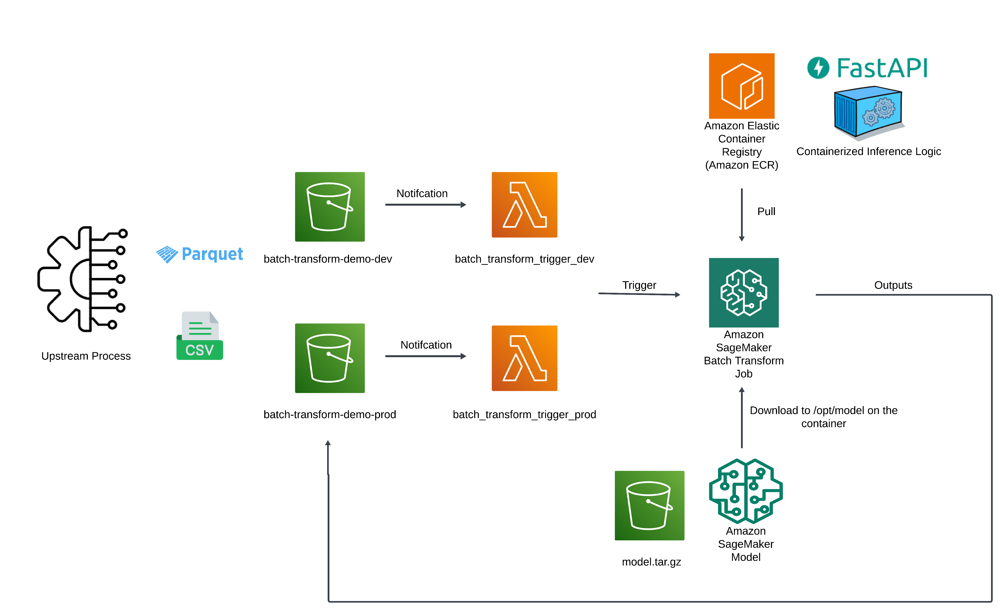

## Step 1

Set up a github repository for this project on github and create a [personal access token](https://docs.github.com/en/authentication/keeping-your-account-and-data-secure/managing-your-personal-access-tokens). This will be provided in `variables.tfvars` in order for sagemaker to clone the repository to the notebook instance. 

## Step 2

Navigate to `terraform/sagemaker`:

- Check out the different configuration files and update the `variables.tfvars` file with the necessary data.

- Provision the resources:

    - **ECR**: This will be used to store the docker image for serving the model.

    - **S3 Bucket**: This will be used to store the model artifacts and the training data (if necessary).

    - **IAM Role**: We create an execution role for sagemaker with the necessary permissions.

        - [SageMakerFullAccess](https://docs.aws.amazon.com/aws-managed-policy/latest/reference/AmazonSageMakerFullAccess.html)
        - [AmazonEC2ContainerRegistryFullAccess](https://docs.aws.amazon.com/aws-managed-policy/latest/reference/AmazonEC2ContainerRegistryFullAccess.html)
        - A custom policy that allows the principal that assumes the role to access any S3 bucket.

      Fine-tune the permissions as needed.

    - **Secrets Manager**: We store the github personal access token in secrets manager. This is used by sagemaker to clone the (private) repository to the notebook instance. This can be skipped if the repository is public.

    - **Security Group**: We create a security group with no inbound rules and allow outbound traffic to the internet. Internet access is required for the notebook instance to clone the repository, download dependencies from the internet, etc.

    - **VPC**: We create a VPC with two public subnets spanning two availability zones. The notebook instance will be launched in this VPC in one of the availability zones.

    - **SageMaker Notebook Instance**: We create a sagemaker notebook instance with the necessary configuration. The notebook instance will be launched in the VPC created above. Additionally, we incorporate [lifecycle scripts](https://docs.aws.amazon.com/sagemaker/latest/dg/notebook-lifecycle-config.html) for setting up [code-server](https://github.com/coder/code-server) on SageMaker, directly taken from the [AWS Code-Server solution](https://github.com/aws-samples/amazon-sagemaker-codeserver) developed by solutions engineers at AWS. 
    
        - **`install_codeserver.sh`**
            - Installs `code-server` during the creation of a new SageMaker Notebook Instance.
            - Executes only once during the initial setup.

        - **`setup_codeserver.sh`**
            - Configures `code-server` every time the notebook instance starts, including the initial setup and subsequent restarts.

       
      I made a small modification in `setup_codeserver.sh` to install [uv](https://docs.astral.sh/uv/) each time the notebook instance starts. This can be removed if not needed.

        ```bash
        # Install uv
        echo "Installing uv..."
        curl -LsSf https://astral.sh/uv/install.sh | bash
        ```

## Step 3

The `notebooks/batch_transform_demo.ipynb` notebook orchestrates the demo. The steps are as follows:

- If terraform has been used to provision the resources, the notebook will automatically fetch the necessary data such as the ecr repository uri, s3 bucket name, etc. from the terraform state file. Again, if run locally, ensure that the default profile has permissions to read from the s3 terraform state bucket or pass the `--profile` to refer to a profile that does.

- We generate some random data, train a logistic regression model, and save the model artifacts to the s3 bucket.

- We build the docker image `docker/serve.Dockerfile` and push it to the ecr repository using the `docker/build_and_push.sh` script.

- Create the [Model](https://sagemaker.readthedocs.io/en/stable/api/inference/model.html) entity.

- Test trigger the batch transform job directly from the notebook.

## Step 4 Lambda Integration

For the lambda integration, we create a lambda function that triggers the batch transform job. The lambda function is created using the `terraform/lambda` module. 

The process can be visualized as follows:

<center>
    
</center>
